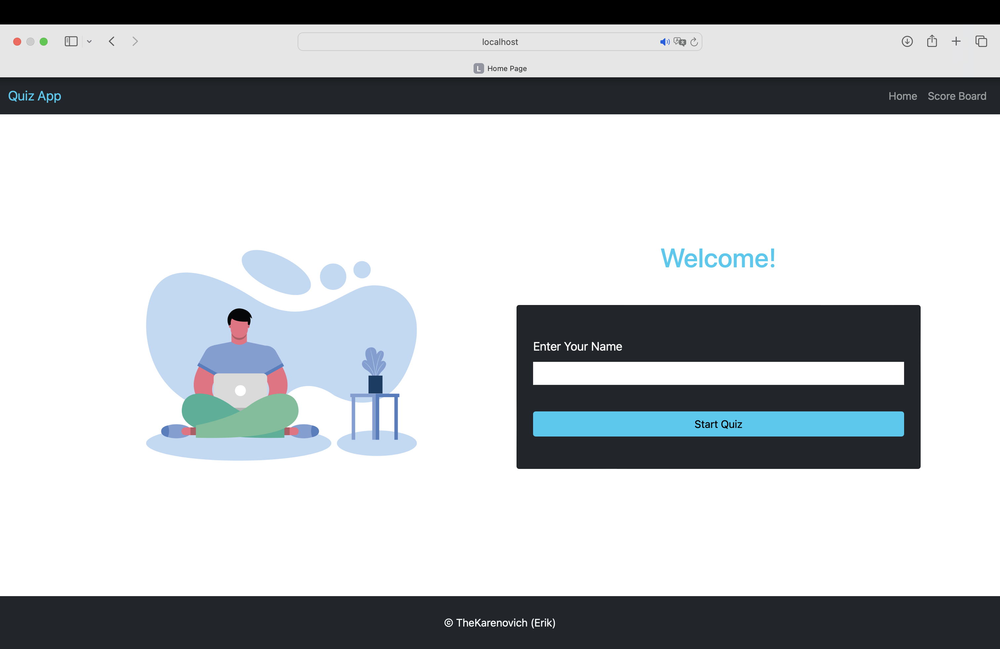
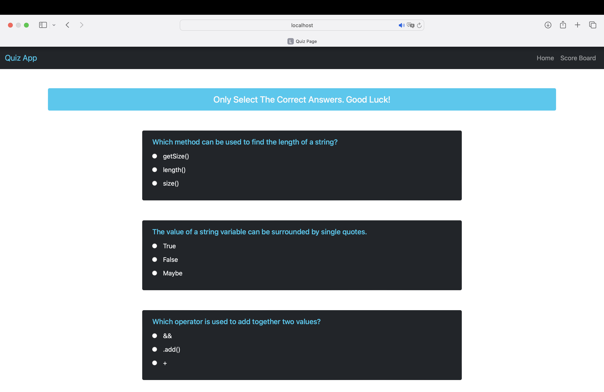
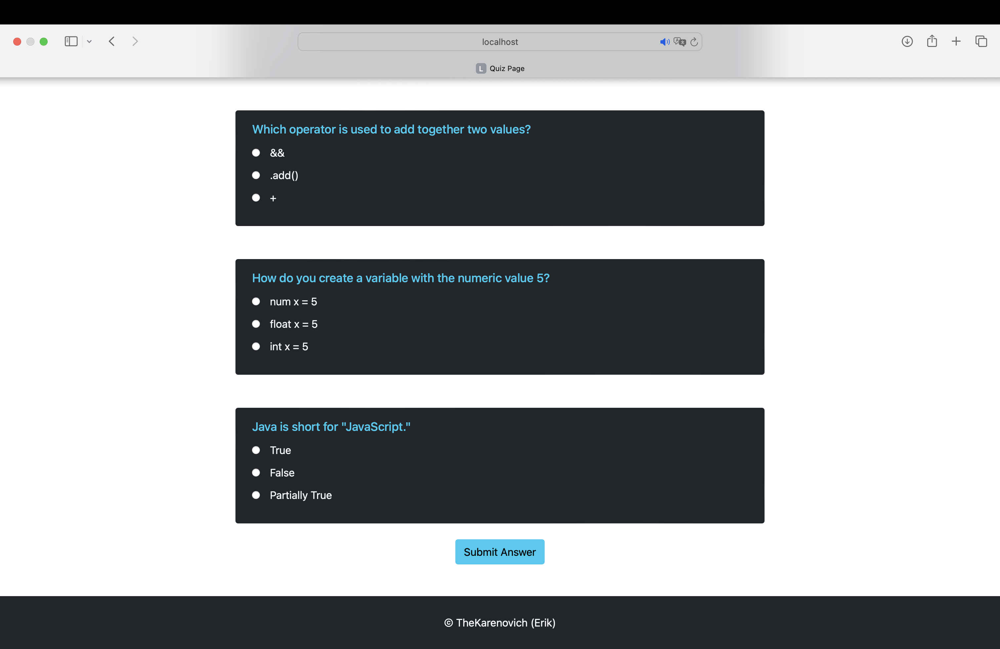
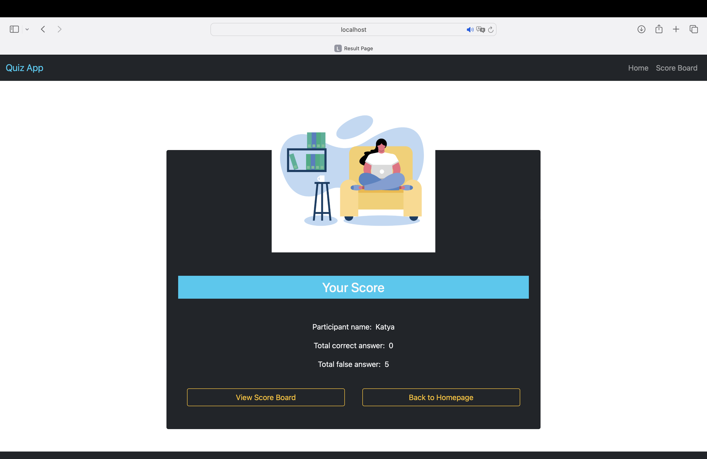

# Quiz App 📝

Quiz App - это простое приложение для проведения викторин, построенное с использованием Java и Spring Boot. Оно позволяет пользователям пройти викторину, отправить свои ответы и просмотреть свои результаты на доске лидеров. Приложение использует Thymeleaf для серверного рендеринга и Bootstrap для стилизации.

## Особенности ✨

- Пользователь должен ввести имя, в противном случае будет показано предупреждение.
- Вопросы викторины отображаются по одному с вариантами выбора.
- Пользователь может выбрать только один ответ на каждый вопрос.
- После отправки викторины подсчитывается и отображается счет пользователя.
- Результаты сохраняются и могут быть просмотрены на доске лидеров.
- Приложение имеет отзывчивый дизайн и адаптировано для мобильных устройств.

## Используемые технологии 🛠️

- Java
- Spring Boot
- Thymeleaf
- Bootstrap
- HTML
- CSS

## Скриншоты 📷


Главная страница


Страница викторины


Вопрос викторины


Страница результатов


Доска лидеров

## Начало работы 🚀

Чтобы запустить это приложение локально, следуйте этим шагам:

1. Склонируйте репозиторий:

```
git clone <repository-url>
```

2. Перейдите в каталог проекта:

```
cd <project-directory>
```

3. Соберите проект с помощью Maven:

```
mvn clean install
```

4. Запустите приложение:

```
mvn spring-boot:run
```

5. Откройте веб-браузер и получите доступ к приложению по адресу `http://localhost:8080`.

6. Наслаждайтесь викториной!

## Вклад 🤝

Приветствуются вклады! Если у вас есть идеи или предложения по улучшению этого проекта, не стесняйтесь отправлять pull request.

## Свяжитесь со мной 📧

Если у вас есть вопросы или обратная связь, не стесняйтесь связаться со мной по адресу [thekarenovich@yandex.ru].

Продолжайте учиться и программировать! 💻🌟
